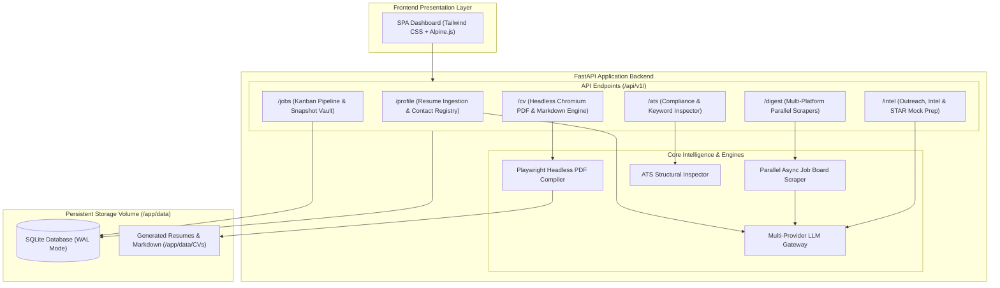

<div align="center">

# CareerQuest ⚡
### Enterprise-Grade AI Career Intelligence & ATS Resume Studio

[](https://github.com/yosefxk/career-quest/actions)
[](https://fastapi.tiangolo.com)
[](https://www.docker.com/)
[](https://tailwindcss.com/)
[](https://playwright.dev/)
[](https://www.sqlite.org/)
[](https://opensource.org/licenses/MIT)

<p align="center">
  <b>High-speed job discovery, dynamic ATS resume customization, recruiter outreach synthesis, and interview preparation — self-hosted on your own infrastructure.</b>
</p>

[Key Features](#-key-features) •
[Architecture](#-architecture) •
[Quickstart](#-quickstart-guide) •
[Portainer Deployment](#-portainer-stack-deployment) •
[Configuration](#-configuration-reference) •
[Testing](#-testing--quality-assurance) •
[Architecture Decisions](#-architecture-decision-records-adrs) •
[Tech Stack](#-technology-stack)

</div>

---

## 💡 Overview

**CareerQuest** is an open-source, self-hostable career operations platform engineered for software engineers, technical program managers, and engineering leaders. 

Modern job applications require precision: matching job descriptions to verified career impact, adhering to strict single-page Applicant Tracking System (ATS) constraints, reaching out directly to hiring managers with high-converting pitches, and preparing role-specific technical and behavioral STAR scenarios. 

CareerQuest unifies this entire operational lifecycle into a private, containerized workspace backed by an intelligent multi-provider LLM gateway and headless Chromium rendering engine.

---

## ✨ Key Features

### 🧭 1. Multi-Platform Parallel Discovery Engine
* **High-Throughput Scraping**: Concurrently queries **Greenhouse** and **Ashby** API endpoints across industry-leading technology organizations (including autonomous systems, AI infrastructure, cybersecurity, big data, and high-scale SaaS).
* **Live SSE Progress Stream**: Real-time server-sent event (SSE) updates track portal query status, deduplication, and pipeline availability.
* **Grounded Compensation & Leveling**: Automatically extracts and calibrates market compensation benchmarks and leveling insights.
* **Learned Search Preferences**: Dynamically factors in candidate feedback ratings to adjust match scoring on future portal scans.

### 📄 2. Dynamic Master Profile & Universal Ingestion
* **Universal Resume Parser**: Ingest existing resumes in **PDF**, **Markdown**, **TXT**, or **YAML** formats. The integrated AI extractor standardizes:
  * Complete contact and social registry (Email, Phone, Location, Citizenship/Work Authorization, LinkedIn, GitHub, Portfolio).
  * Work experience history parsed into structured, tagged bullet banks.
  * Formal education, degree honors, and credentials.
  * Categorized technical, leadership, and system skill sets.
* **Archetype Synthesis**: Maintains distinct executive profiles (e.g., *Technical Program Manager*, *Data Infrastructure Lead*, *Engineering Director*) tailored from a single source of truth.

### 🎯 3. Interactive Bullet Bank & Strict 1-Page Rendering Engine
* **Option C Bullet Pool Bank**: Select and reorder tailored experience bullets on demand with instant category filtering.
* **Strict Single-Page Length Budget**: Dynamic bullet counter ensures every generated document adheres strictly to standard 1-page recruiter viewing baselines.
* **Pixel-Perfect Headless Chromium Rendering**: Uses Jinja2 and Playwright to compile clean, high-DPI PDFs formatted specifically for parsing algorithms and human reviewers.
* **Markdown & Plaintext Export**: Automatically produces a structured `.md` resume alongside every compiled PDF for 1-click clipboard pasting into application portals.

### 🔍 4. Real-Time ATS Compliance & Keyword Density Auditor
* **Deterministic ATS Scoring (0–100%)**: Validates text-layer extractability, standard Workday/Greenhouse section headers, direct contact hierarchy, and single-page margins.
* **Keyword Coverage Radar**: Evaluates job descriptions against candidate profiles to identify critical technical competencies, cloud platforms, and architecture keywords.
* **Immutable Snapshot Vault**: Freezes applied resume versions, custom summaries, bullet sets, and job postings into historical audit logs.

### ⚡ 5. Outreach & Interview Preparation Studio
* **3-Variant InMail Synthesis**: Generates customized outreach messages tailored for:
  1. *Hiring Managers & Engineering Directors* (Value-first ROI pitch).
  2. *Talent Acquisition Leads* (Application reference & follow-up).
  3. *Peer Engineers* (Contextual networking & warm referral inquiry).
* **Role-Specific Mock Interview Studio**: Generates 10 targeted interview scenarios (5 Technical Architecture Deep-Dives + 5 STAR Behavioral Challenges) with structured answer blueprints based on the exact job requirements.
* **Company Intelligence Dossier**: Summarizes strategic priorities, tech stack analysis, and interview style focus areas.

### 🔌 6. Multi-Provider AI Gateway & Local LLM Support
* **Zero Vendor Lock-In**: Toggle seamlessly between leading cloud providers and 100% private, self-hosted local LLMs via standard environment variables:
  * **Google Gemini** (`gemini-2.5-flash`, `gemini-3.6-flash`, `gemini-1.5-pro`)
  * **OpenAI** (`gpt-4o`, `gpt-4o-mini`, `o1`)
  * **Anthropic Claude** (`claude-3-5-sonnet-20241022`, `claude-3-5-haiku-20241022`)
  * **Groq** (`llama-3.3-70b-versatile`)
  * **Ollama** (`llama3.1`, `mistral`, `deepseek-r1`, `qwen2.5`) for 100% offline air-gapped privacy
  * **Local OpenAI-Compatible Runtimes** (**LM Studio**, **vLLM**, **LocalAI**) running on host or LAN


---

## 🏗️ Architecture



---

## 📋 Prerequisites

Before running CareerQuest, ensure you have the following installed on your host system:

* **Docker** (Engine version 24.0+) & **Docker Compose** (version 2.20+)
  * *OR* **Portainer CE / Business** for visual container management.
* **AI API Key**: At least one API key from Google Gemini, OpenAI, Anthropic, or Groq (or a local running **Ollama** server).

---

## 🚀 Quickstart Guide

### Option A: Run with Docker Compose (Recommended)

1. **Clone the Repository**:
   ```bash
   git clone https://github.com/yosefxk/career-quest.git
   cd career-quest
   ```

2. **Configure Environment Variables**:
   ```bash
   cp .env.example .env
   ```
   Open `.env` in your text editor and set your AI provider credentials:
   ```ini
   PORT=8099
   AI_PROVIDER=gemini
   AI_API_KEY=your_gemini_api_key_here
   AI_MODEL=gemini-3.6-flash
   ```

3. **Launch the Container Stack**:
   ```bash
   docker compose up -d --build
   ```

4. **Access the Dashboard**:
   Open **`http://localhost:8099`** in your browser.

---

### Option B: Local Python Development Setup

If you prefer to run the FastAPI backend and frontend directly on your host machine without Docker:

```bash
# 1. Create and activate a Python virtual environment
python3 -m venv .venv
source .venv/bin/activate

# 2. Install backend dependencies and Playwright Chromium
pip install -r backend/requirements.txt
playwright install chromium --with-deps

# 3. Configure environment
export DATA_DIR="./data"
export CVS_DIR="./data/CVs"
export AI_PROVIDER="gemini"
export AI_API_KEY="your_api_key_here"
export AI_MODEL="gemini-3.6-flash"

# 4. Start the development server
python -m uvicorn app.main:app --app-dir backend --host 0.0.0.0 --port 8099 --reload
```

---

## 🐳 Portainer Stack Deployment

CareerQuest is designed for single-click deployment within Portainer:

1. In Portainer, navigate to **Stacks** &rarr; **Add stack**.
2. Set the Name to `career-quest`.
3. Select **Web editor** and paste the contents of [`docker-compose.yml`](docker-compose.yml):
   ```yaml
   services:
     career-quest:
       image: career-quest:latest
       build:
         context: https://github.com/yosefxk/career-quest.git#main
         dockerfile: Dockerfile
       container_name: career-quest
       restart: unless-stopped
       ports:
         - "${PORT:-8099}:8000"
       environment:
          - DATA_DIR=/app/data
          - CVS_DIR=/app/data/CVs
          - AI_PROVIDER=${AI_PROVIDER:-gemini}
          - AI_API_KEY=${AI_API_KEY}
          - AI_MODEL=${AI_MODEL:-gemini-3.6-flash}
          - OLLAMA_BASE_URL=${OLLAMA_BASE_URL:-http://host.docker.internal:11434}
          - LOCAL_LLM_BASE_URL=${LOCAL_LLM_BASE_URL:-http://host.docker.internal:1234/v1}
          - OPENAI_BASE_URL=${OPENAI_BASE_URL:-https://api.openai.com/v1}
          - ANTHROPIC_BASE_URL=${ANTHROPIC_BASE_URL:-https://api.anthropic.com/v1}
          - GROQ_BASE_URL=${GROQ_BASE_URL:-https://api.groq.com/openai/v1}
        extra_hosts:
          - "host.docker.internal:host-gateway"
        volumes:
          - career_quest_data:/app/data
        healthcheck:
          test: ["CMD", "curl", "-f", "http://localhost:8000/api/health"]
          interval: 30s
          timeout: 5s
          retries: 3

   volumes:
     career_quest_data:
   ```
4. Under **Environment variables**, set according to your chosen provider:
   * **Ollama (Local / Offline)**:
     * `AI_PROVIDER`: `ollama`
     * `AI_MODEL`: `llama3.1` (or `mistral`, `deepseek-r1`, `qwen2.5`)
     * `OLLAMA_BASE_URL`: `http://host.docker.internal:11434`
     * `AI_API_KEY`: *(leave blank)*
   * **LM Studio / vLLM / LocalAI (Local OpenAI-compatible)**:
     * `AI_PROVIDER`: `local`
     * `AI_MODEL`: `local-model`
     * `LOCAL_LLM_BASE_URL`: `http://host.docker.internal:1234/v1`
     * `AI_API_KEY`: *(leave blank)*
   * **Google Gemini**:
     * `AI_PROVIDER`: `gemini`
     * `AI_API_KEY`: `<your_gemini_api_key>`
     * `AI_MODEL`: `gemini-2.5-flash` or `gemini-3.6-flash`
   * **OpenAI**:
     * `AI_PROVIDER`: `openai`
     * `AI_API_KEY`: `<your_openai_api_key>`
     * `AI_MODEL`: `gpt-4o-mini` or `gpt-4o`
   * **Anthropic Claude**:
     * `AI_PROVIDER`: `anthropic`
     * `AI_API_KEY`: `<your_anthropic_api_key>`
     * `AI_MODEL`: `claude-3-5-sonnet-20241022`
   * **Groq**:
     * `AI_PROVIDER`: `groq`
     * `AI_API_KEY`: `<your_groq_api_key>`
     * `AI_MODEL`: `llama-3.3-70b-versatile`
5. Click **Deploy the stack**.

---

## ⚙️ Configuration Reference

| Environment Variable | Default Value | Description |
| :--- | :--- | :--- |
| `PORT` | `8099` | External host port mapping for the web application. |
| `AI_PROVIDER` | `gemini` | Primary AI provider: `gemini`, `openai`, `anthropic`, `groq`, `ollama`, or `local` (LM Studio/vLLM). |
| `AI_API_KEY` | *(Empty)* | API authentication key for cloud providers. **Not required** for local LLMs (`ollama`, `local`). |
| `AI_MODEL` | `gemini-2.5-flash` | Specific model identifier to use (automatically defaults per provider). |
| `DATA_DIR` | `/app/data` | Path to persistent storage for SQLite databases and metadata. |
| `CVS_DIR` | `/app/data/CVs` | Directory where compiled PDFs and Markdown resumes are exported. |
| `OLLAMA_BASE_URL` | `http://host.docker.internal:11434` | Endpoint for self-hosted local Ollama instances. |
| `LOCAL_LLM_BASE_URL`| `http://host.docker.internal:1234/v1` | Endpoint for local OpenAI-compatible runtimes (LM Studio, vLLM, LocalAI). |
| `OPENAI_BASE_URL` | `https://api.openai.com/v1` | Custom OpenAI-compatible proxy or gateway endpoint. |
| `ANTHROPIC_BASE_URL` | `https://api.anthropic.com/v1` | Custom Anthropic API endpoint. |
| `GROQ_BASE_URL` | `https://api.groq.com/openai/v1` | Groq high-speed inference endpoint. |

---

## 🧪 Testing & Quality Assurance

CareerQuest includes an automated unit and integration test suite built with `pytest` and `httpx`:

```bash
# Run test suite on host
make test
# OR via pytest directly
pytest -v backend/tests

# Run test suite inside running Docker container
docker exec career-quest pytest -v /app/tests
```

Continuous integration runs automatically on every push and pull request via [GitHub Actions](.github/workflows/ci.yml) across Python 3.11 and 3.12.

---

## 📚 Architecture Decision Records (ADRs)

Key architectural decisions, trade-offs, and design rationales are documented in the [`docs/adr/`](docs/adr/) directory:

* [**ADR 0001**](docs/adr/0001-sqlite-wal-mode.md): SQLite with Write-Ahead Logging (WAL) for Self-Hosted Portability.
* [**ADR 0002**](docs/adr/0002-headless-chromium-pdf-engine.md): Headless Chromium & CSS Paged Media for ATS Resume Compilation.
* [**ADR 0003**](docs/adr/0003-pluggable-llm-gateway.md): Pluggable Multi-Provider LLM Gateway with Structured JSON Validation.

---

## 🛠️ Technology Stack

* **Backend API**: [FastAPI](https://fastapi.tiangolo.com/) (Python 3.11/3.12) with asynchronous routers and Pydantic v2 schemas.
* **Document Engine**: [Playwright](https://playwright.dev/) Headless Chromium for pixel-perfect PDF compilation and [PyPDF](https://pypdf.readthedocs.io/) for document parsing.
* **Data Storage**: [SQLite](https://www.sqlite.org/) with Write-Ahead Logging (WAL) mode for fast concurrent operations.
* **Scraper Engine**: Asynchronous HTTPX client querying Greenhouse and Ashby REST APIs.
* **Frontend UI**: Single-page application built with [Tailwind CSS](https://tailwindcss.com/), [Alpine.js](https://alpinejs.dev/), and [FontAwesome 6](https://fontawesome.com/).
* **Deployment**: Multi-stage Docker container with embedded Chromium dependencies.

---

## 🔒 Privacy & Security

* **100% Self-Contained**: All candidate data, application histories, and generated resumes remain strictly on your own hardware.
* **Zero Telemetry**: CareerQuest does not include tracking scripts, third-party analytics, or external telemetry.
* **Local Inference Option**: Full support for Ollama allows you to run models (such as Llama 3.3 or Mistral) locally without sending resume data to external cloud APIs.

---

## 📄 License

This project is licensed under the [MIT License](LICENSE).
